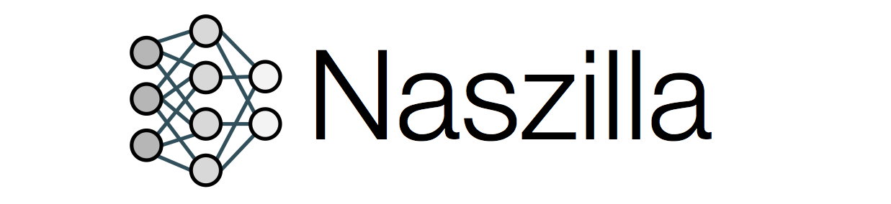
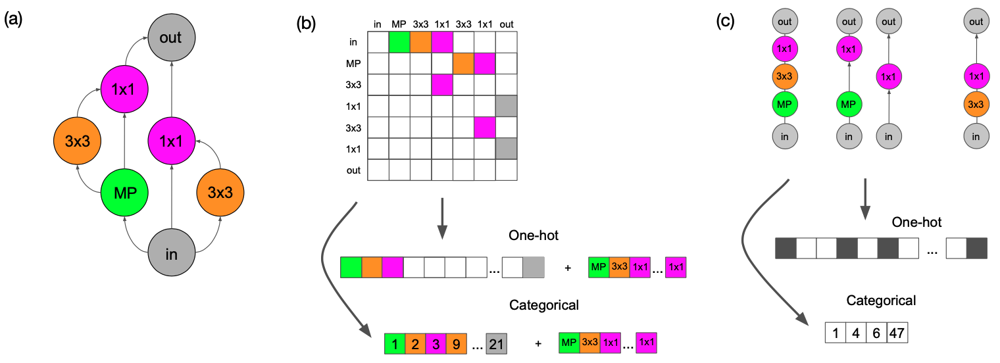
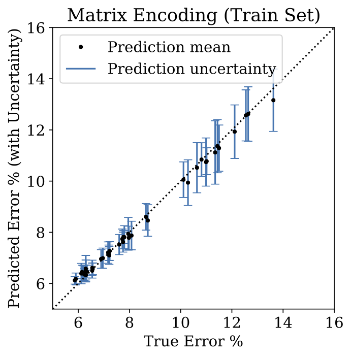
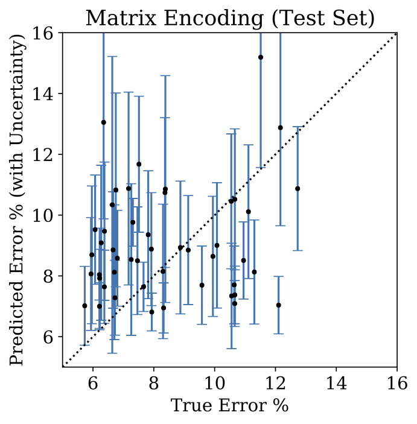
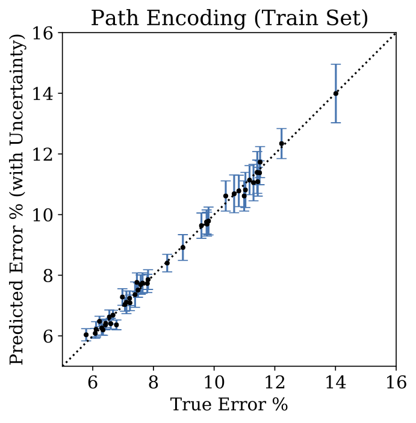
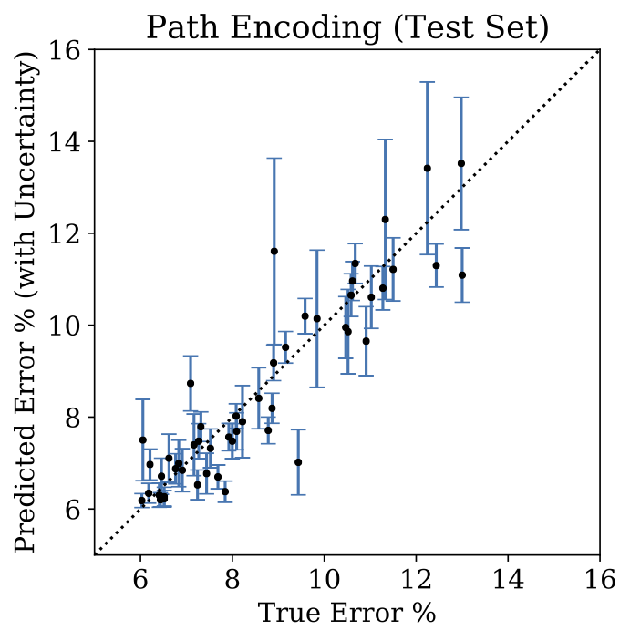
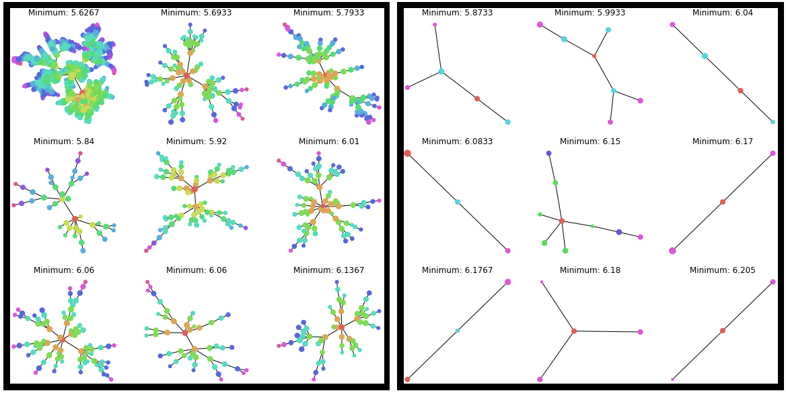

<p align="center"></p>

[](LICENSE.md)

A repository to compare many popular NAS algorithms seamlessly across three popular
benchmarks (NASBench 101, 201, and 301). You can implement your own NAS algorithm, and
then easily compare it with eleven algorithms across three benchmarks.

This repository contains the official code for the following three papers:

<table>
 <tbody>
    <tr align="center" valign="bottom">
      <th>Paper</th>
      <th>README</th>
      <th>Blog Post</th>
    </tr>
    <tr> <!-- (1st row) -->
    <td rowspan="1" align="center" valign="middle" halign="middle"> <a href="https://arxiv.org/abs/2007.04965" target="_blank">A Study on Encodings for Neural Architecture Search</a> </td>
    <td align="center" valign="middle"> <a href="docs/encodings.md">encodings.md</a> </td>
    <td align="center" valign="middle"> <a href="https://abacus.ai/blog/2020/10/02/a-study-on-encodings-for-nas/" target="_blank">Blog Post</a> </td>
    </tr>
    <tr> <!-- (2nd row) -->
    <td rowspan="1" align="center" valign="middle" halign="middle"> <a href="https://arxiv.org/abs/1910.11858" target="_blank">BANANAS: Bayesian Optimization with Neural Architectures for Neural Architecture Search</a> </td>
    <td align="center" valign="middle"> <a href="docs/bananas.md">bananas.md</a> </td>
    <td align="center" valign="middle"> <a href="https://medium.com/reality-engines/bananas-a-new-method-for-neural-architecture-search-192d21959c0c" target="_blank">Blog Post</a> </td>
    </tr>
    <tr> <!-- (3rd row) -->
    <td rowspan="1" align="center" valign="middle" halign="middle"> <a href="https://arxiv.org/abs/2005.02960" target="_blank">Exploring the Loss Landscape in Neural Architecture Search</a> </td>
    <td align="center" valign="middle"> <a href="docs/local_search.md">local_search.md</a> </td>
    <td align="center" valign="middle"> <a href="https://abacus.ai/blog/local-search-is-state-of-the-art-for-neural-architecture-search-benchmarks/" target="_blank">Blog Post</a> </td>
    </tr>
 </tbody>
</table>

## Installation
Clone this repository and install its requirements (which includes [nasbench](https://github.com/google-research/nasbench), 
[nas-bench-201](https://github.com/D-X-Y/NAS-Bench-201), and [nasbench301](https://github.com/automl/nasbench301)). 
It may take a few minutes.
```bash
git clone https://github.com/naszilla/naszilla
cd naszilla
cat requirements.txt | xargs -n 1 -L 1 pip install
pip install -e .
```
You might need to replace line 32 of `src/nasbench301/surrogate_models/surrogate_models.py`
with a new path to the configspace file:
```python
self.config_loader = utils.ConfigLoader(os.path.expanduser('~/naszilla/src/nasbench301/configspace.json'))
```
Next, download the nas benchmark datasets (either with the terminal commands below,
or from their respective websites
([nasbench](https://github.com/google-research/nasbench),
[nas-bench-201](https://github.com/D-X-Y/NAS-Bench-201), and
[nasbench301](https://github.com/automl/nasbench301)).
The versions recommended for use with naszilla are `nasbench_only108.tfrecord`, `NAS-Bench-201-v1_0-e61699.pth`, and `nasbench301_models_v0.9.zip`.
If you use a different version, you might need to edit some of the naszilla code.
```bash
# these files are 0.5GB, 2.1GB, and 1.6GB, respectively
wget https://storage.googleapis.com/nasbench/nasbench_only108.tfrecord
wget https://ndownloader.figshare.com/files/25506206?private_link=7d47bf57803227af4909 -O NAS-Bench-201-v1_0-e61699.pth
wget https://ndownloader.figshare.com/files/24693026 -O nasbench301_models_v0.9.zip
unzip nasbench301_models_v0.9.zip
```
Place the three downloaded benchmark data files in `~/nas_benchmark_datasets` (or choose
another directory and edit line 15 of `naszilla/nas_benchmarks.py` accordingly).

Now you have successfully installed all of the requirements to run **eleven NAS
algorithms** on **three benchmark search spaces**!

### Test Installation

You can test the installation by running these commands:
```bash
cd naszilla
python naszilla/run_experiments.py --search_space nasbench_101 --algo_params all_algos --queries 30 --trials 1
python naszilla/run_experiments.py --search_space nasbench_201 --algo_params all_algos --queries 30 --trials 1
python naszilla/run_experiments.py --search_space nasbench_301 --algo_params all_algos --queries 30 --trials 1
```

These experiments should finish running within a few minutes.
<br><br>

## Run NAS experiments on NASBench-101/201/301 search spaces

```bash
cd naszilla
python naszilla/run_experiments.py --search_space nasbench_201 --dataset cifar100 --queries 100 --trials 100
```
This will test several NAS algorithms against each other on the NASBench-201 search
space. Note that NASBench-201 allows you to specify one of three datasets: cifar10, cifar100, or imagenet. 
To customize your experiment, open `naszilla/params.py`. Here, you can change the
algorithms and their hyperparameters. For details on running specific methods,
see [these docs](docs/naszilla.md).

## Contributions
Contributions are welcome!

## Reproducibility
If you have any questions about reproducing an experiment, please [open an issue](https://github.com/naszilla/naszilla/issues) 
or email `colin@abacus.ai`.

## Citation
Please cite our papers if you use code from this repo:
```bibtex
@inproceedings{white2020study,
  title={A Study on Encodings for Neural Architecture Search},
  author={White, Colin and Neiswanger, Willie and Nolen, Sam and Savani, Yash},
  booktitle={Advances in Neural Information Processing Systems},
  year={2020}
}

@inproceedings{white2021bananas,
  title={BANANAS: Bayesian Optimization with Neural Architectures for Neural Architecture Search},
  author={White, Colin and Neiswanger, Willie and Savani, Yash},
  booktitle={Proceedings of the AAAI Conference on Artificial Intelligence},
  year={2021}
}

@inproceedings{white2021exploring,
  title={Exploring the Loss Landscape in Neural Architecture Search},
  author={White, Colin and Nolen, Sam and Savani, Yash},
  booktitle={Uncertainty in Artificial Intelligence},
  organization={PMLR},
  year={2021}
}
```

## Contents

This repo contains [encodings](docs/encodings.md) for neural architecture search, a
variety of NAS methods (including [BANANAS](docs/bananas.md), a neural predictor
Bayesian optimization method, and [local search](docs/local_search.md) for NAS), and an
easy interface for using multiple NAS benchmarks.

Encodings:
<p align="center">
  
</p>

BANANAS:
<p align="center">
  
  
  
  
</p>

Local search:
<p align="center">
  
</p>
