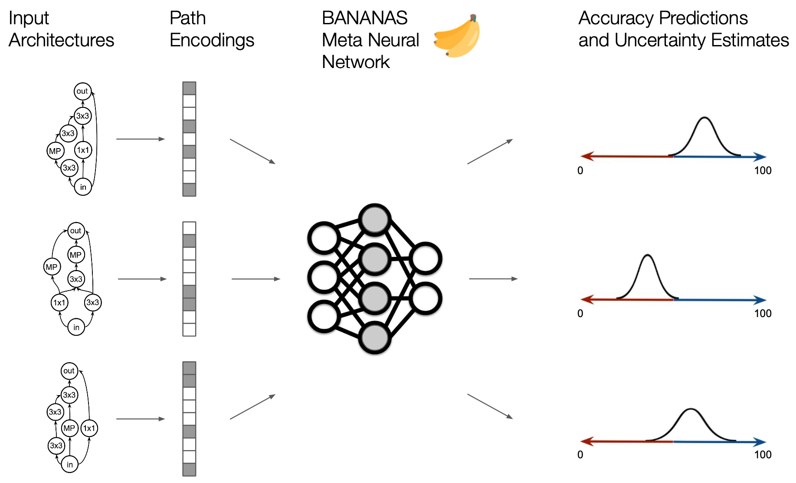
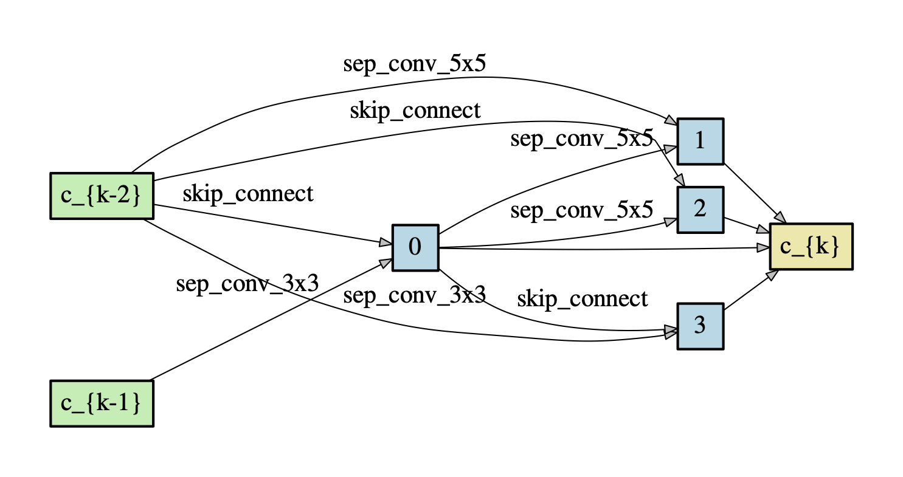
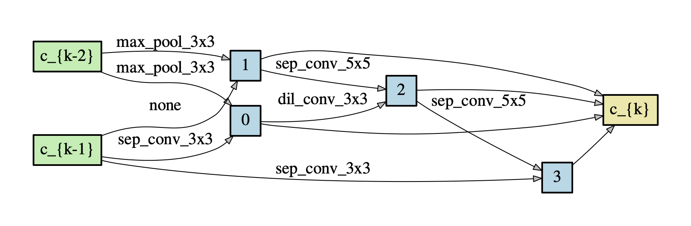
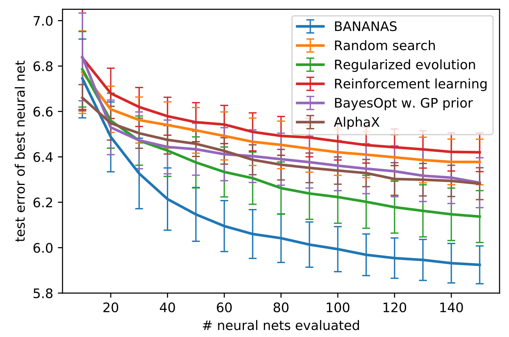

# BANANAS

[BANANAS: Bayesian Optimization with Neural Architectures for Neural Architecture Search](https://arxiv.org/abs/1910.11858)\
Colin White, Willie Neiswanger, and Yash Savani.\
_arXiv:1910.11858_.

## A new method for neural architecture search
BANANAS is a neural architecture search (NAS) algorithm which uses Bayesian optimization with a meta neural network to predict the validation accuracy of neural architectures. We use a path-based encoding scheme to featurize the neural architectures that are used to train the neural network model. After training on just 200 architectures, we are able to predict the validation accuracy of new architectures to within one percent on average. The full NAS algorithm beats the state of the art on the NASBench and the DARTS search spaces. On the NASBench search space, BANANAS is over 100x more efficient than random search, and 3.8x more efficent than the next-best algorithm we tried. On the DARTS search space, BANANAS finds an architecture with a test error of 2.57%.

<p align="center">

</p>

## Requirements
- jupyter
- tensorflow == 1.14.0 (used for all experiments)
- nasbench (follow the installation instructions [here](https://github.com/google-research/nasbench))
- nas-bench-201 (follow the installation instructions [here](https://github.com/D-X-Y/NAS-Bench-201))
- pytorch == 1.2.0, torchvision == 0.4.0 (used for experiments on the DARTS search space)
- pybnn (used only for the DNGO baselien algorithm. Installation instructions [here](https://github.com/automl/pybnn))

If you run experiments on DARTS, you will need our fork of the darts repo:
- Download the repo: https://github.com/naszilla/darts
- If the repo is not in your home directory, i.e., `~/darts`, then update line 5 of `bananas/darts/arch.py` and line 8 of `bananas/train_arch_runner.py` with the correct path to this repo


## Train a meta neural network with a notebook on the NASBench dataset
- Download the nasbench_only108 tfrecord file (size 499MB) [here](https://storage.googleapis.com/nasbench/nasbench_only108.tfrecord)
- Place `nasbench_only108.tfrecord` in the top level folder of this repo
- Open and run `meta_neuralnet.ipynb` to reproduce Table 1 and Figure A.1 of our paper

<p align="center">
  
  
  
  
</p>

## Evaluate pretrained BANANAS architecture
The best architecture found by BANANAS on the DARTS search space achieved 2.57% test error. To evaluate our pretrained neural architecture, download the weights [bananas.pt](https://drive.google.com/file/d/1d8jnI0R9fvXBjkIY7CRogyxynEh6TWu_/view?usp=sharing) and put it inside the folder `<path-to-darts>/cnn`

```bash
cd <path-to-darts>/cnn; python test.py --model_path bananas.pt
```

The error on the test set should be 2.57%. This can be run on a CPU or GPU, but it will be faster on a GPU.

<p align="center">


</p>
<p align="center">
The best neural architecture found by BANANAS on CIFAR-10. Convolutional cell (left), and reduction cell (right).
</p>

## Train BANANAS architecture
Train the best architecture found by BANANAS.

```bash
cd <path-to-darts>/cnn; python train.py --auxiliary --cutout
```

This will train the architecture from scratch, which takes about 34 hours on an NVIDIA V100 GPU. 
The final test error should be 2.59%.
Setting the random seed to 4 by adding `--seed 4` will result in a test error of 2.57%.
We report the random seeds and hardware used in Table 2 of our paper [here](https://docs.google.com/spreadsheets/d/1z6bHUgX8r0y9Bh9Zxot_B9nT_9qLWJoD0Um0fTYdpus/edit?usp=sharing).

## Run BANANAS on the NASBench search space
To run BANANAS on NASBench, download `nasbench_only108.tfrecord` and place it in the top level folder of this repo.

```bash
python run_experiments_sequential.py
```

This will test the nasbench algorithm against several other NAS algorithms on the NASBench search space.
To customize your experiment, open `params.py`. Here, you can change the hyperparameters and the algorithms to run.
To run experiments with NAS-Bench-201, download `NAS-Bench-201-v1_0-e61699.pth` and place it in the top level folder of this repo.
Choose between cifar10, cifar100, and imagenet. For example,

```bash
python run_experiments_sequential.py --search_space nasbench_201_cifar10
```

<p align="center">

</p>

## Run BANANAS on the DARTS search space
We highly recommend using multiple GPUs to run BANANAS on the DARTS search space. You can run BANANAS in parallel on GCP using the shell script:

```bash
run_experiments_parallel.sh
```

## Contributions
We welcome community contributions to this repo!

## Citation
Please cite [our paper](https://arxiv.org/abs/1910.11858) if you use code from this repo:

```bibtex
@article{white2019bananas,
  title={BANANAS: Bayesian Optimization with Neural Architectures for Neural Architecture Search},
  author={White, Colin and Neiswanger, Willie and Savani, Yash},
  journal={arXiv preprint arXiv:1910.11858},
  year={2019}
}
```

